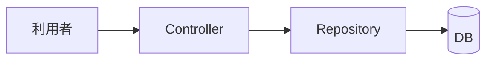
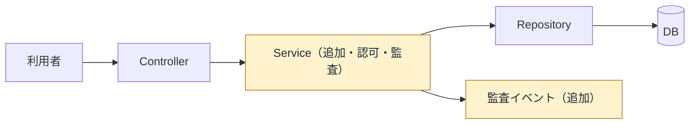

# create-pull-request

GitHub PRを、日本語で短く、レビュー判断に必要な文脈が残る形で作成・更新する。コード詳細を追わなくても変更の境界と流れをつかめるよう、変更範囲に応じて変更前後のMermaid図を添える。

## 原則

- リポジトリ側に英語指定がない限り、PRタイトル・本文・コメントは日本語で書く。
- PR本文は「何を変えたか」だけでなく、「なぜ必要か」「どの層・境界が変わったか」「なぜ別案を取らなかったか」が分かるようにする。
- HermesがPRを作成・更新する場合も、このskillのテンプレートを使う。Hermesがskillを直接読めない場合でも、同じ見出しと内容要件を満たす。
- 実装ログ、長い試行錯誤、内部都合の羅列は避ける。レビュー担当者が判断に必要な情報へ絞る。
- 図はコード詳細の代替ではなく、差分を読む順序を示す概要である。図にない詳細を図から推測させない。

## PR本文の必須構成

PR本文には次の見出しを必ず含める。

````markdown
## 概要
- <端的な変更点>

## 背景と目的
<なぜこの変更が必要か。どの問題、制約、運用上の困りごとを解くか。>

## 変更前後の構造
<変更の境界をまたぐ場合は、変更前・変更後のMermaid図。単一層の局所変更なら省略理由を1行。>

## 検討したが取らなかった選択肢
- <選択肢>: <取らなかった理由>

## 確認
- <実行した確認コマンドや確認内容>
````

`変更前後の構造` は、2つ以上の責務レイヤーにまたがる変更、API・イベント・非同期処理・DB・認可境界の変更、外部システムとの連携変更、または状態遷移の変更を含むPRでは図を必須にする。それ以外の単一層の局所変更では、次のように省略理由を残す。

````markdown
## 変更前後の構造
図は単一層の局所変更で、レイヤー間の依存・実行順・データ構造に変更がないため省略。
````

図を作る場合の図種の選択、テンプレート、可読性の基準は [references/diagram-guidance.md](references/diagram-guidance.md) に従う。

`確認` はコード変更を含むPRでは原則必須。ドキュメントだけのPRでも、未実行なら `未実行: <理由>` と書く。

## 書き方

### 概要

- 1から3個の箇条書きにする。
- 差分の要点を読むだけで変更範囲が分かるようにする。
- 「修正」「対応」だけで終わらせず、対象と振る舞いを書く。

### 背景と目的

- 発生していた問題、ユーザー影響、運用上のリスク、設計上の狙いを簡潔に書く。
- issue、障害、レビュー指摘、cron失敗などのきっかけがある場合はここに書く。
- 「なぜ今やるか」が分かる粒度にする。

### 変更前後の構造

- `git diff <base>...HEAD` と実装を根拠に、変更前と変更後を同じ視点・同じ粒度で描く。現行コードだけから過去の構造を推測しない。
- レイヤーと依存方向の変更には `flowchart`、実行順の変更には `sequenceDiagram`、永続化関係の変更には `erDiagram`、型・契約の変更には `classDiagram` を主図として選ぶ。主図では答えられないレビュー判断がある場合だけ別の図種を追加する。
- 変更したノード・境界・矢印を図中で明示し、色だけに意味を持たせない。図の直下に「読み方」「変更点」「根拠ファイル」を短く書く。
- 差分や実装で確認できないノード・矢印・保存先を補わない。未確定の仕様は図に入れず、本文の未確認事項として分離する。
- MermaidはGitHub互換の構文だけを使う。矢印は `-->`、`-.->`、`==>` など標準形式に限定し、独自記号や構文を発明しない。
- 変更していない周辺は最小限に残す。全クラス、全テーブル、全エンドポイントを列挙しない。
- 1図1メッセージを守り、主図1組（変更前・変更後）を基本とする。専門図を足す場合も、主図では答えられないレビュー判断を補うものだけにする。
- Mermaidが表示されない環境でも意味が伝わるよう、図の前後に1から3文の要約を置く。

### 検討したが取らなかった選択肢

- 少なくとも1件は書く。
- 典型例:
  - 何もしない: 通知漏れや再発リスクが残るため不採用。
  - 呼び出し側に注意喚起だけ追加する: 付け忘れを防げないため不採用。
  - 大きな共通化を先に行う: 今回の修正範囲に対して過剰で、検証範囲が広がるため不採用。
- 「検討なし」とだけ書かない。小さなPRでも、現実的に取り得た別案と不採用理由を1つ書く。

### 確認

- 実行したコマンドはバッククォートで書く。
- 失敗後に直して再実行した場合は、最終的に通った確認と、残る未確認事項を書く。
- 未実行の確認を成功したように書かない。

## PR作成時の手順

- PR作成前に差分とコミット範囲を確認する。
- 差分が触れるレイヤー、外部境界、実行順、データ構造、型・契約を列挙し、図の要否と図種を決める。
- 図を作る場合は、変更前をベース側のコード、変更後を今回の差分から確認し、同じ視点で対にする。
- 図のノード・矢印が実装上の責務と一致することを根拠ファイルで確認する。推測や未実装の将来像を混ぜない。
- タイトルは変更の結論を短く書く。リポジトリ側に規約がなければ日本語にする。
- `gh pr create` やGitHub UIへ渡す本文は、このskillの必須構成で作る。
- 既存PRを更新する場合も、不足している必須見出しを補う。既存の図が差分とずれていれば、本文だけでなく図も更新する。

## 例

````markdown
## 概要
- APIから直接DBを読む処理をサービス層へ移し、認可チェックを一箇所に集約
- 失敗時の監査イベントを追加

## 背景と目的
エンドポイントごとにDBアクセスと認可判断が分散し、同じ条件の変更漏れが起きやすかったため、責務の境界を整理します。

## 変更前後の構造
### 変更前


### 変更後


- 読み方: Controllerは入力受付、Serviceは業務判断、RepositoryはDBアクセスを担当します。
- 変更点: Serviceを追加し、認可・監査イベントの責務をControllerから移しました。
- 根拠: `src/orders/order.controller.ts`、`src/orders/order.service.ts`、`src/audit/audit-event.ts`

## 検討したが取らなかった選択肢
- Controller内に認可処理を残す: 他の入口から同じルールを再利用できず、分散が残るため不採用。

## 確認
- `bun test src/orders`
- `bun run lint`
```
````
