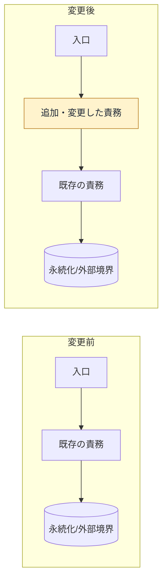
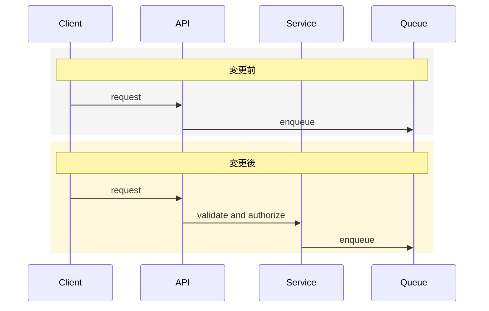
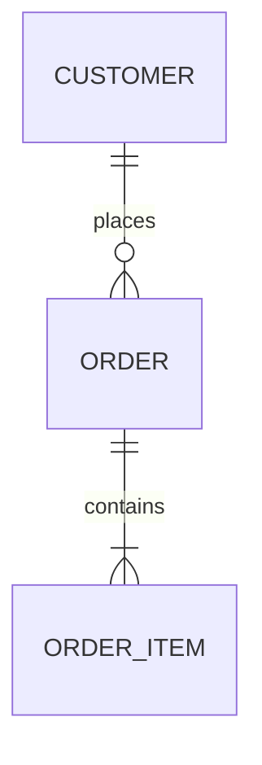
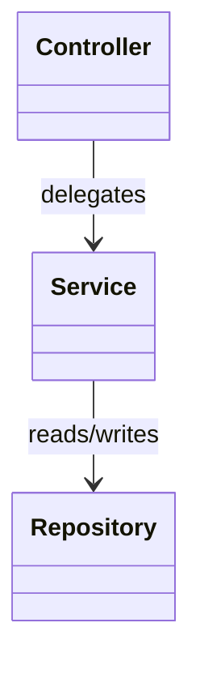

# PR用Mermaid図のガイド

PR本文の図は、レビュー担当者がコードを読む前に「どの境界が変わり、何が変わっていないか」を把握するために使う。実装の全体図や将来構想ではなく、今回の差分に限定する。

## 図種の選択

| 図種 | 使う問い | 主な対象 | 使わない場合 |
| --- | --- | --- | --- |
| `flowchart` | どの層・コンポーネントが、どこへ依存するか | UI、API、Service、Repository、外部サービス、Queue、DB | 依存関係が変わらない単一層の修正 |
| `sequenceDiagram` | 実行時に誰が、どの順番で、何を呼ぶか | HTTP、イベント、非同期ジョブ、リトライ、失敗経路 | 単純な同期呼び出しで主図だけで読める場合 |
| `erDiagram` | 永続化するデータの関係と境界は何か | テーブル、集約、主キー、カーディナリティ | スキーマ・保存関係が変わらない場合 |
| `classDiagram` | 型・契約・責務の関係は何か | interface、class、DTO、adapter、継承・実装 | 型や契約の構造がレビュー対象でない場合 |

レイヤーと依存方向の変更には`flowchart`、実行順の変更には`sequenceDiagram`、永続化関係の変更には`erDiagram`、型・契約の変更には`classDiagram`を主図として選ぶ。例えば、Serviceを追加してDBまでの経路が変わるなら`flowchart`、そのServiceがイベントを発行する順序も変更するなら`sequenceDiagram`を足す。DBのカラム追加だけなら`erDiagram`を主図にする。

## 変更前後を対にするルール

- 変更前はPRのbase側、変更後は今回の差分を根拠にする。
- 前後で視点、向き、粒度、ノード名をそろえる。比較しやすさを優先し、配置を大きく変えない。
- 追加・変更・削除の対象は、ラベルと短文の両方で明示する。色・太さ・点線だけに意味を持たせない。
- 変更しない周辺をすべて描かない。変更経路を理解するために必要な境界だけ残す。
- before/afterを1枚に押し込んで線が交差する場合は、見出し付きの2枚に分ける。
- 変更前の実装が確認できない場合は、推測で補わず「変更前の構造は確認できない」と明記して図を省略する。
- 差分で確認できない保存先、イベント購読者、リトライ経路などを追加しない。仕様が未確定なら、確認済みの境界だけ描き、未確認事項として残す。
- GitHub互換のMermaid構文を使う。`-->`、`-.->`、`==>`などの標準矢印を使い、`-->?`のような独自の矢印や未確認の記法は使わない。

## 図の直下に書く説明

図の後ろに次の3項目を置く。各項目は1から2文に収める。

```markdown
- 読み方: 左から右へ、または上から下へ、処理・依存の向きを説明する。
- 変更点: 追加・削除・責務移動・境界変更を説明する。
- 根拠: `path/to/file.ts:42` のように、図の各要素を確認できるファイルや行を示す。
```

図が表示されない環境への補助として、図の前に「変更前はAがBを直接呼ぶ。変更後はCを経由する」のような要約を置く。根拠のないレイヤー名、将来予定の矢印、実装していない責務は書かない。

## レイヤー構造図のテンプレート



実際のコード上の責務名に置き換え、`追加`、`責務移動`、`依存方向変更`などをラベルまたは説明文で補う。`入口`や`既存の責務`をそのままPRに残さない。

## シーケンス図のテンプレート



前後で参加者を同じにできない場合は、追加・削除された参加者を説明文で明示する。リトライ、タイムアウト、失敗時の戻りを省かないとレビュー判断を誤る場合は、その経路を描く。

## ER図・クラス図の注意

- `erDiagram` はテーブル名だけでなく、今回の変更に関係するキーとカーディナリティを残す。全カラムを列挙しない。
- `classDiagram` は型の責務と契約を中心にし、実装詳細のメソッド一覧にしない。interfaceとadapterの境界が変わる場合に使う。
- migrationだけでなく、読み書き側・API契約・イベントpayloadが追従しているかを図の根拠と`確認`で示す。
- ER図・クラス図で表せない実行順の変更を、矢印の向きだけで表現しない。必要なら`sequenceDiagram`を併記する。

最小例（実際の名前と関係へ置き換える）。





これらの例にない関係を、実装上の根拠なしに増やさない。ER図はmigrationと読み書き側、クラス図はinterfaceと実装側を突き合わせてから記述する。

## 仕上げのチェック

- [ ] 図の要否は変更したレイヤー・境界に基づいて判断した
- [ ] 変更前と変更後を同じ視点で比較できる
- [ ] 図のすべてのノード・矢印に実装上の根拠がある
- [ ] 変更点を色だけでなくラベルと文章でも示した
- [ ] 主図1組（変更前・変更後）で足りない場合だけ専門図を追加した
- [ ] Mermaidがなくても読める要約・根拠を併記した
