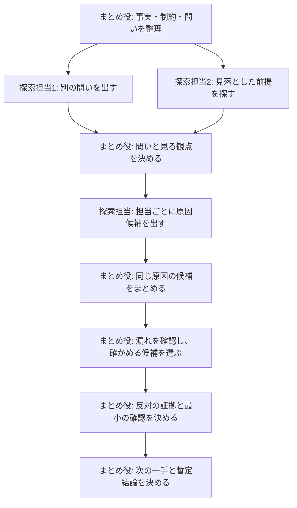
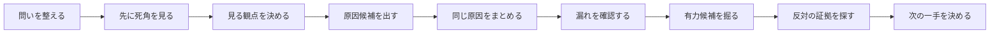

# 仮説を整理して次の一手を決める

解決案を先に選ばない。低い推論量の探索担当が、互いの答えを見ずに原因候補を出す。まとめ役が、それらを整理し、反対の証拠を探し、次の一手を決める。

## 最初の返答

このskillを起動した最初の返答では、解決案を決めない。先に次を示す。

1. 出所付きの観測事実と、まだ推測であること
2. いま確かめる問いと、同じ観測を説明できる別の問い
3. 競合する原因候補と、それぞれが正しい場合に追加で見えること
4. 候補を見分ける最小の確認と、その結果ごとの次の判断

独立した探索担当を使えない場合も、この停止条件は省略しない。制約を明記し、単一担当による順番の検討として同じ4点を返す。

始める前に、まとめ役が十分な推論量で動いているか確認する。確認できない場合は、統合と反証だけを高い推論量の別担当に相談するか、「結論の深さは保証できない」と出力に書く。別担当は候補を追加で起動しない。候補の起動と最終判断は、常にまとめ役が行う。

## 誰が何をするか



図が描画されない環境では、次の順に読む。

1. まとめ役が、分かっている事実・制約・いま決めたいことを整理する。
2. 探索担当が、互いの出力を見ずに候補を出す。探索担当は自分の候補を採用しない。
3. まとめ役が、同じ原因の言い換えをまとめ、別の見方と見分ける確認を選ぶ。
4. まとめ役が、結果を反証し、最も安く安全な次の一手を決める。多数決では決めない。

## 手順

`問いを整える → 先に死角を見る → 見る観点を決める → 候補を出す → 同じ原因をまとめる → 漏れを確認する → 有力候補を掘る → 反対の証拠を探す → 次の一手を決める` の順に進める。事実、推測、未確認を混ぜない。



この順序を変えない。まとめ役は、問い・渡す情報・候補の整理・最終判断を担う。探索担当の出力は多数決や結論として採用せず、確かめる対象として扱う。

### 1. 問いを整える

次を分ける。

- 分かっている事実と出所
- いま決めたいこと、制約、対象外
- 推測と不明点
- **いまの問い**: 現時点で最も確かめやすい問い
- **別の問い**: 同じ事実を別に説明する問いを最大2件
- **いまの問いをやめる条件**: 何が分かれば別の問いへ切り替えるか

解決方法が問いとして渡された場合は、問題・目的・制約を分ける。いまの問いは作業の出発点であり、唯一の前提にしない。

### 2. 先に死角を見る

まとめ役が見る観点を決める前に、会話履歴を引き継がない独立した探索担当を2つ起動する。

- 渡すもの: 確定事実、問いに偏らない決定の種類、制約、一次資料。
- 渡さないもの: いまの問い、別の問い、まとめ役が考えた見る観点。
- 決定の種類には、原因候補やいまの問いの言い換えを書かない。

- **問い直し担当**: 同じ観測をよりよく説明する別の問いを最大2件出し、それぞれを見分ける観測を示す。
- **見落とし担当**: 観測を説明し得る隠れた前提または原因の種類を一つ探し、最小限の反証可能な候補を返す。

独立した探索担当を起動したら、起動した全担当の結果が返るまで待つ。全結果が揃う前に、探索結果の統合、反証、結論、実装へ進まない。未帰還の担当の結果を推測や補完で埋めない。

まとめ役は、結果をいまの問い・別の問い・見る観点へ反映するか棄却し、その理由を記録する。新しさの判断は、見る観点を決めた後にまとめ役が行う。探索担当に「既存の外か」を判定させない。

### 3. 見る観点を決める

いまの問いに対して、どこを見るかを選ぶ。既知の分類を機械的に当てはめず、問いとどう関係するかを短く示す。

- 設計: ドメインの意味、状態遷移、整合性、セキュリティ、失敗時、運用・監査、時間、分散、変更容易性、コスト
- 障害・不具合: 入力、状態、並行性、外部依存、時間、リソース、設定、デプロイ差分、観測系
- 業務・プロダクト: 利用者の目的、価値仮説、導線、運用、人・組織、制度・制約、計測、代替手段

### 4. 原因候補を出す

#### 起動する担当

- 第一波は、問い直し担当と見落とし担当を含めて4〜6人にする。
- 各担当は、会話履歴を引き継がず、低い推論量で、書き込みできない権限で起動する。
- この三つを実行環境で確認できない場合は、独立した探索担当を起動しない。
- その場合は、まとめ役が順番に考える方式へ切り替えるか、利用者に制約を示して判断を仰ぐ。
- 順番に考える方式では、問い直し担当と見落とし担当の役も含め、出力冒頭に「独立性なし・単一担当による順番の検討」、各候補に「まとめ役の仮説」と書く。

#### 渡すもの

- 通常の探索担当: いまの問い、確定事実、制約、主な見る観点、一次資料への参照。
- 渡さないもの: 別の問い、まとめ役の暫定結論、他担当の出力、全履歴。
- 主な見る観点は優先順位であり、他を見ることを禁じる境界ではない。近い観点に重要な兆候があれば、深掘りせず追加で見る候補として報告する。

#### 許可しないこと

- 外部への書き込み
- 設定変更
- 破壊的な確認
- 子担当の起動

渡す情報と依頼文の雛形は、[subagent-context.md](references/subagent-context.md)を読む。

#### 返し方

- 通常の探索担当と見落とし担当は、最大2件を次の形で返す。
- 観測事実には `user statement`、`file:line`、`log`、`URL` など確かめられる出所を付ける。
- 出所のない内容は推測として扱う。

```markdown
## 探索担当 <id> / <主な見る観点>

### 候補 <id>-1
- 原因の仮説:
- 原因の種類:
- 起きる仕組み:
- 根拠になる事実: <事実>（出所: <参照元>）
- 他の候補と見分けられる予測:
- 他の候補と分かれる反証条件:
- 最も安く安全な確認:
- 未確認の前提・別の要因:
- 影響度: 高 / 中 / 低
- 確からしさ: 高 / 中 / 低
```

問い直し担当は、最大2件を次の形で返す。

```markdown
## 問い直し担当 <id>

### 別の問い <id>-1
- 別の問い:
- 説明できる事実:
- 見分けるために確かめること:
- この問いが変える判断:
- 現時点で決められない理由:
```

事実が足りない場合は候補を捏造せず、次の形で返す。

```markdown
### 不足情報 <id>-1
- 足りない情報:
- 取得元または確認方法:
- この情報で減る分かれ道:
- 現在は判断しない理由:
```

### 5. 同じ原因の候補をまとめる

候補の数や表現の多さを、そのまま原因の数として数えない。まとめ役は「原因 → 中間の状態 → 観測されたこと」というつながりへ書き直す。

次の**すべて**を満たす場合だけ、同じ原因の候補としてまとめる。

- 直接の原因が同じで、言い換えているだけである。`cache 不具合`のような広い種類ではなく、観測を生む直接の状態・設定・処理まで書く。
- 原因から観測までに起きる仕組みが実質的に同じである。
- 見分ける予測に差がなく、同じ反証で同時に否定できる。

同じ確認方法、同じコマンド、同じ応急対応になるだけではまとめない。必要なら、確認をまとめて実行する組や、対応をまとめて行う組として別に整理する。各組では、予測と反証が最も明確な候補を代表にし、元の担当IDを記録する。

### 6. 漏れを確認する

第一波の結果を整理した後、いまの問い・別の問い・先に見た死角を照合する。第二波は一度だけ、探索担当の総数が8以下、代表候補が5以下の範囲で起動できる。次のどちらかを満たす観点だけを追加する。

- まだ見ていないが、判断を変え得る観点がある。
- 新しい原因候補を示す具体的な一次証拠がある。

別の問いを見分けられない、または既存の候補を最小の確認で区別できないことは、候補を追加する理由にしない。次の「有力候補を掘る」で、見分けるための確認として扱う。上限へ達したら候補出しを終え、まだ見ていないことは「許容した死角」として残す。

上限に達する前でも、次を満たしたら候補出しを終える。件数だけでは決めない。

- 大事な見る観点と別の問いを確認した。
- 直近の探索担当から、新しい原因候補が増えていない。
- 残る死角と、それを許容する理由を説明できる。

自然な候補が少ないなら無理に増やさない。第二波を起動するなら、未探索の観点では「変わり得る判断」を、証拠から起動する場合は「一次証拠と期待する新しい原因候補」を先に書く。代表候補の上限で起動できない観点も、許容した死角として残す。

### 7. 有力候補を掘る

判断への影響、説明力、確認コスト、外したときに得られる情報で上位2〜3件を選ぶ。各候補について次を示す。

- 原因から観測までのつながり
- 正しければ追加で見えること
- 誤りなら見えること、または矛盾
- 反証条件
- 最も安く安全な確認方法
- 正しかった場合の対応と副作用

原因から観測までのつながり、予測、反証のどれかが書けない候補は、掘り下げ済みと扱わない。

### 8. 反対の証拠を探す

暫定首位の候補について、最も強い反論、説明できない事実、別の候補でも同じ観測を説明できる経路を出す。結論を変える情報と、確認後の決定木を示す。証拠が足りなければ確からしさを上げず、「未確定」とする。

### 9. 次の一手を決める

最も小さい確認を一つ勧める。実施内容、期待する観測、所要コスト、成功・失敗時の次の判断を示す。解決策の実行は、十分な根拠があるか、確かめられなくても期限や影響から行動が必要なときだけ勧める。採用理由と、やり直せるかも明記する。

## 出力

通常は整理した結果だけを返す。担当IDや原因候補の対応表は、「監査証跡」を求められたとき、または高リスクな判断のときだけ出す。

```markdown
## いまの問い
- いまの問い:
- 別の問い:
- いまの問いをやめる条件:

## 分かっている事実・推測・不明点

## 見た範囲と、そこで終える理由

## 代表となる原因候補

| 原因候補 | 種類 | 起きる仕組み | 説明できること | まだ説明できないこと |
| --- | --- | --- | --- | --- |

## 有力候補の掘り下げ

## 反対の証拠

## 暫定結論と次の一手

## 監査証跡（必要な場合のみ）
```

単純でやり直せる問題は、第一波を3〜4人へ縮めてよい。ただし、問い直し担当、見落とし担当、同じ原因をまとめること、反証できる確認方法は省略しない。独立した探索担当を起動しない場合は、上記の「独立性なし・単一 agent の逐次シミュレーション」を必ず書く。

## 関連スキル

- `design-review`: 実装前に、すでにある設計案を審査するときに使う。
- `investigating-domain`: コード構造の地図がない調査で、先にまたは並行して事実を集めるときに使う。原因候補の発散・採否・次の確認を決める段階では、このスキルを使う。
- `adversarial-review`: すでにある変更や差分に反対の証拠を探すときに使う。問題の見方を広げる用途には使わない。
- `orchestrate-exploration`: 複数サイクル、現在地メモ、実装の委譲が必要になった時点で引き渡す。
- `research-experiment-loop`: 実験履歴を残し、比較できる次の実験を管理するときに使う。
