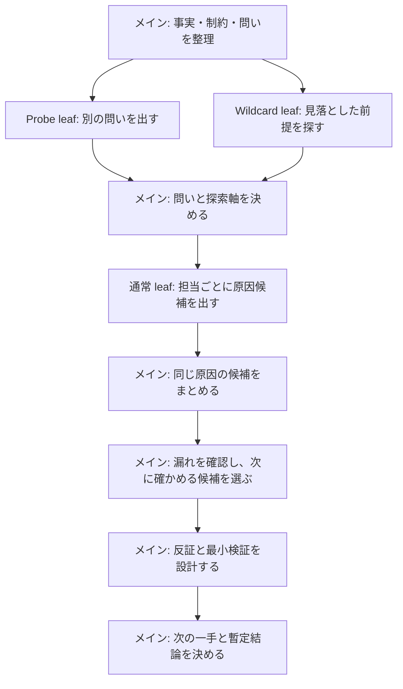

# 仮説フレーミング

解決案を先に選ばない。低推論の leaf subagent で独立に探索し、高推論の親 agent が因果主張を統合・反証・判断する。開始時に親の実効 reasoning effort も確認する。高推論を確認できない場合は、Cluster 以降を高推論の `architect` へ委譲するか、出力に「統合・反証の深さは未保証」と明記する。深さは文章量ではなく、因果鎖・追加予測・反証可能性で判定する。

## 誰が何をするか



図が描画されない環境では、次の順に読む。

1. メインが、分かっている事実・制約・いま決めたいことを整理する。
2. leafが、互いの出力を見ずに候補を出す。leafは自分の候補を採用しない。
3. メインが、同じ原因の言い換えをまとめ、別の見方と見分けるための確認を選ぶ。
4. メインが、結果を反証し、最も安く安全な次の一手を決める。多数決では決めない。

## 進め方

`Frame → Probe → Axes → Branch → Cluster → Audit → Drill → Falsify → Decide` の順に進める。確定事実、推測、未確認を混ぜない。親 agent は問題設定、探索契約、統合、最終判断を担い、leaf 出力を多数決や結論として採用しない。

### 1. Frame: 問いを固定しすぎない

次を分ける。

- 観測された事実と出所
- 意思決定、制約、対象外
- 推測と不明点
- **主問題設定**: 現時点で最も検証可能な問い
- **競合する問題設定**: 同じ事実を別に説明する問いを最大2件
- **主問題設定を棄却する条件**: 何が分かれば競合フレームへ切り替えるか

解決方法が問いとして渡された場合は、問題・目的・制約を分ける。主問題設定は最初の作業仮説であり、Audit 完了まで唯一の前提にしない。

### 2. Probe: 親の軸決めの前に死角を探す

親が探索軸を固定する前に、fresh context の2 leaf を起動する。両者には確定事実、**フレーム中立な意思決定の種類**（例: 最安検証の選択、go/no-go）、制約、一次資料だけを渡し、主問題設定、競合フレーム、親の探索軸は渡さない。意思決定の種類に原因仮説や主問題設定の言い換えを書かない。

- **Reframing leaf**: 同じ観測をよりよく説明する問題設定を最大2件提案し、それぞれを識別する観測を示す。
- **Wildcard leaf**: 観測を説明し得る隠れた前提または原因カテゴリを一つ探し、親の分類を知らずに最小の反証可能な仮説を返す。

親は Probe の結果を主問題設定・競合フレーム・探索軸へ反映するか棄却し、その理由を監査証跡に残す。新規性は Axes を確定した直後に、Frame 時点の仮軸と採用 Axes の両方へ照合して親が判定する。leaf に「外側」を判断させない。

### 3. Axes: 探索空間を設計する

主問題設定に対する探索軸を選ぶ。既知の分類を機械的に当てはめず、問いとの関係を短く示す。

- 設計: ドメインの意味、状態遷移、整合性、セキュリティ、失敗時、運用・監査、時間、分散、変更容易性、コスト
- 障害・不具合: 入力、状態、並行性、外部依存、時間、リソース、設定、デプロイ差分、観測系
- 業務・プロダクト: 利用者の目的、価値仮説、導線、運用、人・組織、制度・制約、計測、代替手段

### 4. Branch: 独立 leaf を段階的に起動する

Probe を含めた第一波は4〜6 leaf とする。通常は read-only の `explorer` を使い、起動時に実効 reasoning effort と sandbox を確認する。leaf は fresh context で起動し、親だけが dispatch する。fresh context、低推論、read-only のいずれかを確認できない場合は、独立 leaf を起動しない。親逐次モードへ切り替える場合は Probe の2役も含め、出力冒頭の非独立性バナーと各項目の出所「親の仮説」を必須にする。確認手段と合否基準は [subagent-context.md](references/subagent-context.md) に従う。

Probe 後の通常 leaf には主担当軸を一つだけ割り当てる。対象外の軸は探索を禁止する境界ではなく、重複を避けるための優先順位に留める。高推論は leaf の案出しに使わず、親の統合と反証に残す。

Probe 後の通常 leaf には、主問題設定、確定事実、制約、担当軸、一次資料への参照だけを渡す。Probe leaf は第2節および [subagent-context.md](references/subagent-context.md) に従う。望ましい解決案、親の暫定結論、他 leaf の出力、全履歴を渡さない。外部への書き込み、設定変更、破壊的な検証、子 subagent の起動を許可しない。

dispatch ごとの最小コンテキスト、資料の渡し方、禁止情報、prompt 雛形は、[subagent-context.md](references/subagent-context.md)を読んで適用する。

各 leaf は最大2件を次の固定フォーマットだけで返す。観測事実には `user statement`、`file:line`、`log`、`URL` など検証可能な参照元を付ける。参照元のない内容は推測として扱う。

```markdown
## Leaf <id> / <担当軸>

### H<id>-1
- 因果仮説:
- 原因カテゴリ:
- 成立する仕組み:
- 根拠になる観測事実: <事実>（出所: <参照元>）
- 隣接仮説と識別できる追加予測:
- 隣接仮説と分かれる反証条件:
- 最安で安全な確認:
- 未確認の前提・交絡要因:
- 影響度: 高 / 中 / 低
- 確度: 高 / 中 / 低
```

事実が足りない場合は仮説を捏造せず、次の形で返す。

```markdown
### I<id>-1
- 不足する識別情報:
- 取得元または確認方法:
- この情報で減る分岐:
- 現在は判断しない理由:
```

### 5. Cluster: 因果仮説だけを統合する

leaf の件数や表現の多さを仮説の数として数えない。親は「原因 → 中間状態 → 観測事象」の因果主張へ正規化する。

次の**すべて**を満たす場合だけ、同じ因果 cluster に統合する。

- 根本原因ノードが同じで、置き換え可能な言い換えである（`cache 不具合` のような原因カテゴリではなく、観測を生む直接の状態・設定・処理をノードにする）
- 原因から観測事象までの成立機序が実質的に同じ
- 識別予測に差がなく、同じ反証条件で同時に倒れる

同じ確認方法、同じコマンド、同じ応急対応へ収束するだけでは統合しない。必要なら別に「検証バッチ」「対応バッチ」としてまとめる。cluster ごとに、識別予測と反証条件が最も明確な代表仮説を採用し、元の leaf ID を監査証跡として残す。

### 6. Audit: 飽和と死角を判定する

第一波を cluster 化した後、主問題設定・競合フレーム・Probe の結果を照合する。第二波は一度だけ、総 leaf 数が8以下、代表 cluster 数が5以下の範囲で起動できる。次のいずれかを満たす軸だけを追加する。

- 未探索だが意思決定を変え得る軸がある
- 新しい因果 cluster を示唆する具体的な一次証拠がある

競合フレームを識別できない、または既存 cluster を最小検証で区別できないことは、再発散の理由にしない。Drill で識別実験として扱う。上限へ達したら発散を終了し、未探索は許容した死角として残す。

上限に達する前でも、次を満たしたら発散を終了する。件数は終了条件にしない。

- 重要な探索軸と競合フレームを確認済み
- 直近の leaf 群から新しい因果 cluster が増えていない
- 残る死角と、それを許容する理由を説明できる

自然な仮説が少数なら無理に増やさない。第二波の leaf は起動理由に応じて、未探索軸なら「変わり得る意思決定」、証拠駆動なら「具体的な一次証拠と期待する新 cluster」を先に宣言する。代表 cluster 数の上限で起動できない未探索軸も、許容した死角として残す。

### 7. Drill: 有望な仮説を深掘りする

意思決定への影響、説明力、検証コスト、外したときの情報量で上位2〜3件を選び、各仮説について次を示す。

- 原因から観測事象までの因果鎖
- 正しければ追加で観測される予測
- 誤りなら観測される予測または矛盾
- 反証条件
- 最安で安全な確認方法
- 正しかった場合の対応と副作用

因果鎖、予測、反証のどれかが書けない仮説は、深掘り済みと扱わない。

### 8. Falsify: 結論を壊す

暫定首位の仮説について、最も強い反論、説明できない事実、別仮説でも同じ観測を説明できる経路を出す。結論を変える情報と、確認後の決定木を明示する。証拠が足りなければ確度を上げず「未確定」とする。

### 9. Decide: 次の一手を決める

最小の検証を一つ推奨する。実施内容、期待する観測、所要コスト、成功・失敗時の次の判断を示す。解決策の実行は、十分な根拠があるか、検証不能でも期限・影響から行動が必要なときだけ推奨し、採用理由と可逆性を明示する。

## 出力

通常は統合結果だけを返し、raw leaf ID や cluster 表は「監査証跡」を求められたとき、または高リスクな判断のときだけ展開する。

```markdown
## 問題設定
- 主問題設定:
- 競合する問題設定:
- 主問題設定を棄却する条件:

## 観測事実・推測・不明点

## 探索範囲と飽和判断

## 代表仮説一覧

| 仮説 | カテゴリ | 仕組み | 説明できること | 未確認・説明できないこと |
| --- | --- | --- | --- | --- |

## 有力仮説の深掘り

## 反証レビュー

## 暫定結論と次の一手

## 監査証跡（必要な場合のみ）
```

単純で可逆な問題は、第一波を3〜4 leaf へ縮めてよい。ただし Reframing と Wildcard、因果 cluster、反証可能な確認方法は省略しない。独立 leaf を起動しない全経路では、出力冒頭に「独立性なし・単一 agent の逐次シミュレーション」と明記し、Reframing・Wildcard・担当軸ごとの固定フォーマットを親が順番に埋め、出所を「親の仮説」と明示する。

## 関連スキル

- `design-review`: 実装前に既存の設計案を審査するときに使う。
- `investigating-domain`: コード構造の地図がない調査では先に、または並行して事実を収集するときに使う。仮説の発散・採否・次の検証設計に入る時点でこのスキルを使う。
- `adversarial-review`: 既存の変更・差分を反証するときに使う。問題設定の発散には使わない。
- `orchestrate-exploration`: 複数サイクル、現在地メモ、実装委譲が必要になった時点で引き渡す。
- `research-experiment-loop`: 実験履歴を永続化し、比較可能な次実験を管理するときに使う。
